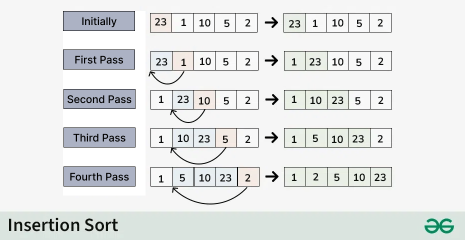

1. Giải thích cách hoạt động của thuật toán insertion sort:
Sắp xếp chèn một thuật toán sắp xếp đơn giản hoạt động bằng cách lặp lại việc chèn từng
phần tử của một danh sách chưa được sắp xếp vào vị trí chính xác của nó trong một phần đã được sắp xếp của danh sách.
Nó giống như việc sắp xếp các lá bài trong tay bạn. Bạn chia các nhóm lá bài thành hai: các lá bài đã được sắp xếp và các lá bài chưa được sắp xếp.
Sau đó, bạn chọn một lá bài từ nhóm chưa được sắp xếp và đặt nó vào vị trí chính xác trong nhóm đã được sắp xếp.

- Chúng tôi bắt đầu với mảng thứ hai của phần tử tử vì phần tử đầu tiên trong mảng được sắp xếp đã được sắp xếp.
- So sánh phần tử thứ hai với phần tử thứ nhất và kiểm tra xem phần tử thứ hai có nhỏ hơn và không thay đổi kích thước của chúng.
- Di chuyển đến phần tử thứ ba và so sánh nó với hai phần tử đầu tiên và đặt nó vào vị trí chính xác
- Lặp lại cho đến khi sắp xếp toàn bộ mảng.

2. Giải thích cách hoạt động của insertion sort:
a) Vòng lặp ngoài (for i)
- Biến i đại diện cho vị trí hiện tại trong mảng đang được kiểm tra. Bắt đầu 
từ phần tử thứ 2 trong mảng, vì phần tử đầu tiên được coi là phần tử được
sắp xếp sẵn

b) Vòng lặp thứ 2 (while j >= 0 and curr < numbers[j]):
- Biến j là phẩn tử nằm bên phía tay trái, nếu curr < numbers[j], rời phần tử numbers[j] sang phải (numbers[j + 1] = numbers[j]).
Giảm j để tiếp tục kiểm tra phần tử trước đó.
- Dùng biến curr để lưu giá trị tạm thời trong quá trình hoán đổi
- Giảm j để tiếp tục kiểm tra phần tử trước đó.

c) Minh hoạ: 
```python
numbers = [100, 20, 10, 16, 6, 89]

for i in range(1, len(numbers)):
    j = i - 1
    curr = numbers[i]
    while j >= 0 and curr < numbers[j]:
        numbers[j + 1] = numbers[j]
        j -= 1
    numbers[j+1] = curr
```
1. Lần lặp đầu tiên i = 1: 
- So sánh từng phần tử:
```python
* numbers[1] (20) < numbers[0] (100): #Rời [20,100,10,16,6,89]
* numbers[2](10) < numbers[1](100) && numbers[2] (10) > numbers[0](20): 
#=> Hoán đổi [10,20,100,16,6,89]
* numbers[3] < numbers[2](100) && numbers[3] < numbers[1] (20) && numbers[3] (16) > numbers[0] 
#=> Hoán đổi [10,16,20,100,6,89]
* numbers[4] < numbers[3](100) && numbers[4] < numbers[2](20) && numbers[4] < numbers[1] (16) &&  numbers[4] (6) < numbers[0] (10) 
#=> Hoán đổi [6,10,16,20,100,89]
* numbers[5] (89) < numbers[4] (100) && numbers[5] > numbers[3] (20) && numbers[5] > numbers[2] (16) && numbers[5] > numbers[1] (10) && numbers[5] > numbers[0] (6)
#=> Hoán đổi [6,10,16,20,89,100]
```