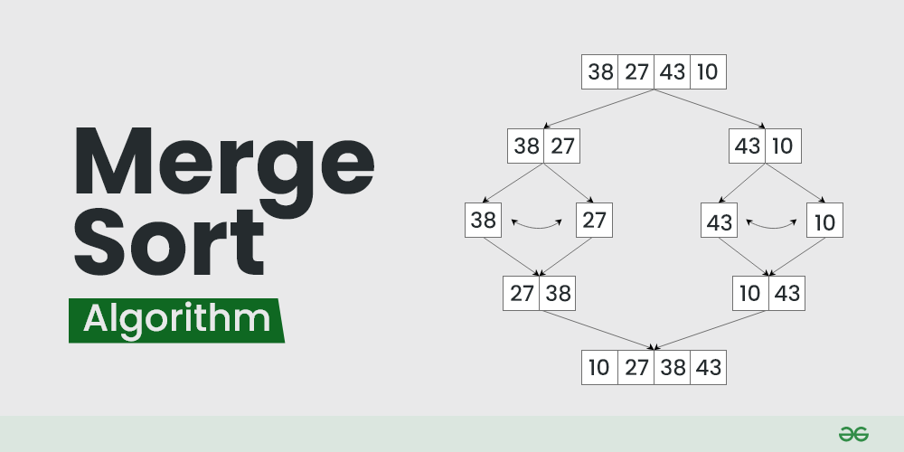

1. Giải thích cách hoạt động của thuật toán merge sort:
   Merge Sort là một thuật toán sắp xếp phổ biến được biết đến với hiệu quả và tính ổn định.
   Thuật toán này tuân theo phương pháp chia để trị để sắp xếp một mảng các phần tử nhất định.
   Sau đây là giải thích từng bước về cách hoạt động của thuật toán sắp xếp trộn:

- Chia: Chia danh sách hoặc mảng theo cách đệ quy thành hai nửa cho đến khi không thể chia được nữa.
- Chinh phục: Mỗi mảng con được sắp xếp riêng lẻ bằng thuật toán sắp xếp trộn.
- Hợp nhất: Các mảng con đã sắp xếp được hợp nhất lại với nhau theo thứ tự đã sắp xếp. Quá trình tiếp tục
  cho đến khi tất cả các phần tử từ cả hai mảng con đã được hợp nhất.
  numbers = [20, 10, 16, 6, 89, 1, 5, 9, 100]

# Divide

def divide(numbers, start, end):
if start == end:
return [numbers[start]]
else:
middle = (start + end) // 2
left_numbers = divide(numbers, start, middle)
right_numbers = divide(numbers, middle+1, end)
return conquer(numbers, left_numbers, right_numbers)

# Sort

def conquer(numbers, left_numbers, right_numbers):
new_nums = []
i = 0
j = 0
while i < len(left_numbers) and j < len(right_numbers):
if left_numbers[i] < right_numbers[j]:
new_nums.append(left_numbers[i])
i += 1
else:
    new_nums.append(right_numbers[j])
    j += 1
    if i < len(left_numbers):
    new_nums += left_numbers[i:]

    if j < len(right_numbers):
        new_nums += right_numbers[j:]
    return new_nums

divide(numbers, 0, len(numbers)-1)

2.  Giải thích cách hoạt động của merge sort:
    a) Chia nhỏ:
1.  Lần lặp thứ nhất

- Gọi divide(numbers, 0, len(numbers) -1)

start = 0
end = 8

=> midle = (start + end) // 2 = 4
divide(numbers, 0, 4) - divide(numbers, 5, 8)
left: [20, 10, 16, 6, 89] - right:[1, 5, 9, 100]

2. Lần lặp thứ hai:
   left = divide(numbers, 0, 4) => middle = (0 + 4)//2 = 2
   Chia: left = divide(numbers, 0, 2) [20, 10, 16]
   right = divide(numbers, 3, 4) [6, 89]

right = divide(numbers, 5, 8) => middle = (5 + 8)// = 6
Chia: left = divide(numbers, 5, 6) [1, 5]
right = divide(numbers, 7, 8) [9, 100]

3. Lặp lần thứ 3:
   divide(numbers, 0, 2) [20, 10, 16]
   => middle = (0 + 2) // 2 = 1
   left: divide(number, 0, 1) [20, 10]
   right: [16] chạy vào điều kiện đầu

divide(numbers, 3, 4) [6, 89]
=> middle = (3 + 4) // 2 = 3
left: [6]
right: [89]

divide(numbers, 5, 6) [1,5]
=> middle = (5+6) // 2 = 5
left: [1]
right: [5]

divide(numbers, 7, 8) [9, 100]
=> middle = (7 + 8) // 2 = 7
left: [9]
right: [100]

4. Lần lặp thứ 4:

divide(numbers, 0, 1) [20, 10]
left: [20]
right: [10]

=> [20] [10] [16] [6] [89] [1] [5] [9] [100]

b) Kết hợp:

1. Lần lặp thứ nhất (lúc này là các mảng đơn lẻ nên sẽ chạy hết qua các mảng đơn lẻ)

i = 0
j = 0

left: [20] right: [10]

- left[0] (20) > right[0] (10) => new_nums.append(right_numbers) new_nums = [10]
  chạy tiếp if i < len(left_numbers) (do 20 là phần tử còn thừa trong left_numbers) => [10, 20]

left: [16] right: [6]

- left[0] (16) > right[0] (6) => new_nums.append(right_numbers) new_nums = [6]
  chạy tiếp if i < len(left_numbers) (do 16 là phần tử còn thừa trong left_numbers) => [6, 16]

left: [89] right: [1]

- => [1] => [1, 89]

left: [5] right: [9]

- => [5] => [5, 9] (9 phần tử còn lại right_numbers)

left: [100]
[10, 20] [6,16] [1, 89] [5, 9] [100] 2. Lần lặp thứ 2
Khi bạn thực hiện lần gộp đầu tiên, các biến i và j được sử dụng để duyệt qua các phần tử của mảng con
(tức là left_numbers và right_numbers). Sau mỗi lần gộp xong một cặp mảng con, hàm đệ quy sẽ quay trở
lại cấp trên và thực hiện gộp các mảng con khác. Điều này dẫn đến việc các biến i và j được khởi tạo
lại từ đầu (bằng 0) trong mỗi lần gộp mới.

- left: [10, 20] right: [6, 16]

* So sánh từng phần tử:
  i = 0, j = 0
  10 > 6: [6]. Tăng: j+= 1 => j = 1
  10 < 16: [6, 10]. Tăng: i += 1 => i = 1
  20 > 16: [6, 10, 16]. Ko tăng do điều kiện < len(right_numbers)
  Thêm phần còn lại: [6, 10, 16, 20]

- left: [1, 89] right: [5, 9]
  i = 0, j = 0

1 < 5: [1]. Tăng i = 1
89 > 5: [1, 5]. Tăng j = 1
9 < 89: [1, 5, 9]
Thêm phần tử còn lại: [1, 5, 9, 89]

- left: [100]
  => [6, 10, 16, 20] [1, 5, 9, 89] [100]

3. Lần lặp thứ 3:

\*left: [6, 10, 16, 20] right: [1, 5, 9, 89]
i = 0 , j = 0
6 > 1: [1]. j + 1 = 1
5 < 6: [1, 5]. j + 1 = 2
9 > 6: [1, 5, 6]. i + 1 = 1
10 > 9: [1, 5, 6, 9]. j + 1 = 3
89 > 10: [1, 5, 6, 9, 10]. i + 1 = 2
16 < 89: [1, 5, 6, 9, 16].i + 1 = 3
20 < 89: [1, 5, 6, 9, 16, 20]
=> Thêm phần tử còn lại [1, 5, 6, 9, 16, 20, 89]
[1, 5, 6, 9, 16, 20, 89] [100] 4. Lần lặp thứ 4:

So sánh từng phần tử => [1, 5, 6, 9, 16, 20, 89, 100]
